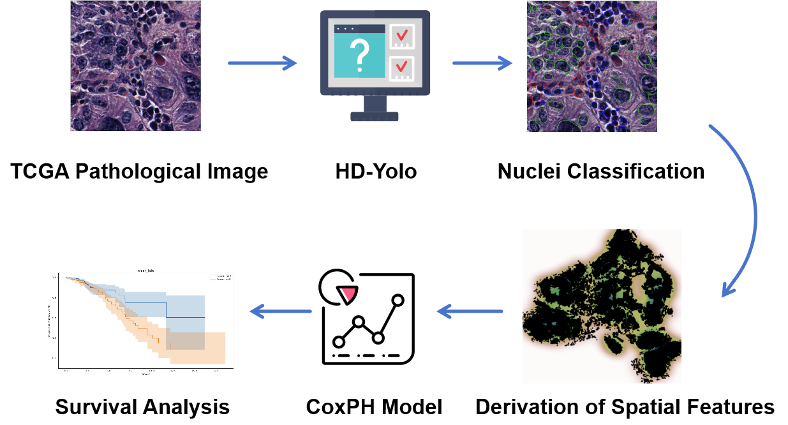

# Digital pathology slides analysis reveals novel survival associated image features
Cancer is the second leading cause of death in the US. Among the various forms of cancer, breast cancer and lung cancer are particularly significant due to their prevalence and impact. Breast cancer in particular contributing to around 30\% of all new female cases each year, while also having some of the highest mortality rates. Scientists and doctors rely on pathology slides to aid in the discovery of a cure, diagnose patients, and provide treatment. These slides play a crucial role in examining samples and identifying any abnormalities. The primary goal of this project was to analyze pathology slides from 873 cancer patients in The Cancer Genome Atlas Breast Invasive Carcinoma (TCGA-BRCA). We developed STAIN (Spatial Tumor and Immune Analysis for Novel insights) with the hypothesize that quantitative analysis of cell type specific clusters in the spatial context can lead to novel insights on patient survival. First, we identified tumor and immune cells using a HD-Yolo algorithm. Then we identify tumor clusters and immune cell clusters. Next, descriptive statistics such as Jaccard distance, Hausdorff distance, Wasserstein distance, tumor density, and immune cell density were derived and correlated with the patients survival while adjusting for clinical attributes such as patient age and tumor stage using Cox proportional Hazard models. The results discover spatial attributes and known clinical risk features associated with survival.

## Pipeline

## How to use

Run survival statistics file, using the preprocessed patient data.
Use the outputted .json file in the notebook to analyse and produce diagrams.

## Contact

For further questions or details, reach out to Jonathan Wang (jonathanwang2029@gmail.com)
